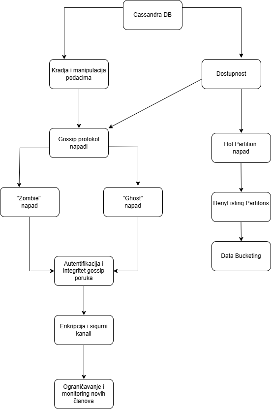

# STABLO NAPADA

## GOSSIP NAPADI

U Cassandra klasteru, gossip protokol služi za razmenu informacija o čvorovima i njihovom stanju. Svaki čvor periodično šalje informacije (“gossip”) svojim partnerima u mreži, tako da se stanje klastera širi epidemijski (kao širenje virusa) i svi čvorovi dobijaju ažurirane informacije.

Napadači mogu iskoristiti ovaj protokol da šire lažne informacije o članstvu, smanjujući tačnost protokola i ugrožavajući performanse višeg sloja skladištenja podataka.

## Pojmovi (potrebni za objašnjenje napada)

- **EndPointState za čvor i** (EndPointState je skup podataka koji opisuje stanje čvora, npr. da li je aktivan, koji su njegovi tokeni i stanje heartbeat-a) zaista dolazi od čvora i i sadrži tačne informacije.
- **Digest `<IP adresa_i, generation_i, version_i>`** (digest je kratak sažetak stanja čvora i koristi se da bi se proverilo da li su podaci o čvoru ažurni) zaista se odnosi na čvor i i baziran je na pravom EndPointState-u tog čvora.
- **Poruka o gašenju (shutdown) čvora i** je zaista poslata od strane tog čvora.

Ako napadač uspe da kontroliše neki čvor m i falsifikuje digest, EndPointState ili shutdown poruku, i pošalje ih u ime nekog drugog čvora, on može privremeno iskriviti prikaz članstva u klasteru. To znači da drugi čvorovi mogu pogrešno videti koji čvorovi rade, a koji ne.

---

## 1 Napad sa EndPointState-ovima i digestima – stvaranje “zombija”

- Napadač m se u početku ponaša kao regularan čvor.
- Kada neki čvor i napusti klaster (zbog kvara ili održavanja), napadač počinje da širi lažne informacije o čvoru i.
- Manipulišući lokalnim stanjem i, napadač može naterati ostale čvorove da veruju da je čvor i i dalje aktivan.

Tokom svake runde gossip protokola:

- m povećava verziju heartbeat-a za i (heartbeat je signal da čvor “živi” i radi).
- Kreira lažni digest.
- Šalje ga partnerima u gossip mreži.

Rezultat: Ostali čvorovi misle da je čvor i aktivan, iako je stvarno otišao ili pao. Takvi čvorovi se nazivaju “zombiji” (zombies) jer deluju mrtvo-živo u klasteru.

---

## 2️ Napad sa lažnim shutdown porukama – stvaranje “ghost” čvorova

Napadač šalje lažne poruke o gašenju čvorova, pa čvorovi koji su zapravo aktivni izgledaju kao da su isključeni.

Takvi čvorovi se nazivaju “ghost” čvorovi.

Posledice uključuju:

- Pogrešno raspoređivanje podataka
- Neuspešne replikacije
- Smanjenu dostupnost podataka

---

## Mitigacije

U ovoj modifikovanoj verziji gossip protokola, svaki Cassandra čvor ima:

- privatni ključ, koji koristi za potpisivanje svojih poruka
- skup javnih ključeva, po jedan za svaki čvor u klasteru, koji se koriste za proveru potpisa.

### Osnovna ideja

Svaki čvor šalje novi objekat digest-a, koji sadrži:

- IP adresu čvora u jasnom tekstu
- originalni digest potpisan privatnim ključem σ

Primer formata digest-a:

`<IP_adresa_i, <IP_adresa_i, geni, versi>σ>`

Drugi deo predstavlja digitalni potpis čvora i.

Tokom svake runde gossip protokola, čvor i:

- Ažurira svoj heartbeat (signal da je čvor aktivan)
- Generiše digitalni potpis
- Kreira svoj digest
- Šalje digest listi gossip partnera

Kada čvor j primi digest:

- Pogleda IP adresu u jasnom tekstu da vidi kojem čvoru digest pripada
- Izabere javnim ključ i (ρi) i pokuša da dešifruje ostatak digest-a
- Ako je digest zaista poslao čvor i, dešifrovanje uspeva; inače, digest se odbacuje
- Kada j dobije sadržaj potpisa, uporedi IP adresu iz potpisa sa adresom u jasnom tekstu
- Zatim nastavlja sa izvršavanjem originalnog gossip protokola

---

# HOT PARTITION ATTACK

## 3. Definicija hot partition napada

Hot partition napad predstavlja scenarij u kojem napadač generiše veliki broj legitimnih zahtjeva koji ciljaju istu vrijednost partition ključa, čime se sav workload usmjerava ka istom čvoru klastera. Kao posljedica, dolazi do neravnomjerne raspodjele opterećenja, povećanja latencije i potencijalnog uskraćivanja usluge.

Za razliku od klasičnih distribuiranih napada uskraćivanja usluge, gdje se cilj postiže ogromnim brojem mrežnih zahtjeva, hot partition napad koristi logiku distribucije baze podataka. Napadač ne mora generisati ekstremno veliki saobraćaj, već samo pažljivo bira vrijednosti ključa kako bi koncentrisao obradu na ograničen dio sistema.

Prevencija hot partition napada zasniva se prvenstveno na pravilnom modelovanju podataka i kontroli pristupa. Jedna od osnovnih tehnika je povećanje kardinalnosti partition ključa dodavanjem dodatne komponente, poput slučajnog “bucket” identifikatora, čime se zahtjevi raspoređuju na više particija.

Dodatno, implementacija mehanizama za ograničavanje brzine zahtjeva (rate limiting) može spriječiti generisanje velikog broja operacija nad istim ključem. Monitoring sistema treba uključivati analizu veličine particija, učestalosti pristupa i raspodjele opterećenja po čvorovima kako bi se potencijalni problemi identifikovali u ranoj fazi.

Kombinacija pravilnog dizajna šeme, operativnog monitoringa i kontrole pristupa predstavlja najefikasniji pristup zaštiti od ove vrste napada.

Zbog određenih obrazaca pristupa i modelovanja podataka, neke particije mogu postati “vrele” (hot partitions) i izazvati nestabilnost Cassandra klastera. Ovo se obično dešava kada veliki broj INSERT ili UPDATE operacija pogađa istu particiju, zbog čega ona vremenom postaje veoma velika i skupa za čitanje i održavanje.

---

## Denylisting (blokiranje “vrelih” particija)

Cassandra omogućava blokiranje takvih particija putem mehanizma **denylisting**. Kada klijent pokuša da izvrši SELECT upit nad blokiranom particijom (bilo direktno po ključu ili kroz opseg podataka), upit će odmah biti odbijen uz grešku `InvalidQueryException`.

Tabela:

- `system_distributed.denylisted_partitions`

Potrebno je unijeti:

- naziv keyspace-a
- naziv tabele
- vrijednost partition ključa

---

# REFERENCE

- https://www.researchgate.net/publication/262160356_Assessing_data_availability_of_Cassandra_in_the_presence_of_non-accurate_membership
- https://docs.datastax.com/en/hyper-converged-database/1.2/cluster-management/gossip-about.html
- https://cassandra.apache.org/doc/latest/cassandra/managing/operating/denylisting_partitions.html
- https://engineeringatscale.substack.com/p/how-discord-solved-hot-partition-problem