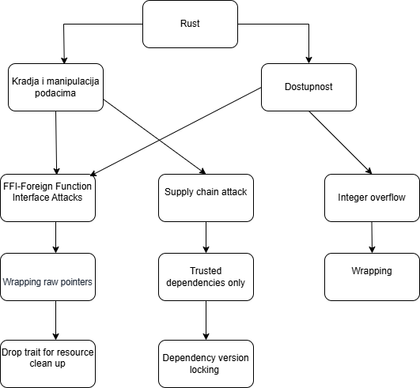

# UVOD

U narednom delu biće objašnjeni neki od napada koji koriste ranjivosti Rusta kao jezika.

## Sigurnosne pretnje

Sigurnosne pretnje po sistem koji se u ovom slučaju obrađuje jesu:

- Kradjom i manipulacijom podataka direktno je narušen princip autentičnosti u CIA trijadi. Bilo da se radi o kradji ličnih i osetljivih podataka, koje potom može da zloupotrebi na različite načine ili o manipulaciji tačnosti podataka, posledica je kompromitovanost sistema.

- Dostupnost sistema jedan je od principa CIA trijade koji garantuje da je sistem uvek dostupan korisniku kada mu je potreban. Nivo nedostupnosti sistema koji se toleriše je varijabilan u odnosu na kritičnost sistema. U analiziranom slučaju, replay napad može direktno da ugrozi dostupnost sistema.

---

## STABLO NAPADA



---

# NAPADI

## FOREIGN FUNCTION INTERFACE - FFI

Interfejs za strane funkcije (Foreign Function Interface – FFI) u Rust-u omogućava jednostavnu interoperabilnost između Rust-a i drugih programskih jezika, naročito C-a. Iako FFI pruža moćne mogućnosti, on takođe uvodi bezbednosne rizike, jer zaobilazi Rust-ove garancije bezbednosti i izlaže program potencijalnim ranjivostima kao što su problemi sa bezbednošću memorije, kompromitovanje podataka i nedefinisano ponašanje. Napad koji će biti opisan u nastavku je control hijack.

Napad koji se izvodi zaobilazi jednostavne provere granica koje Rust ubacuje za određene pristupe memoriji. Za objekte u memoriji sa statički definisanom veličinom, kao što su nizovi, Rust će izvršiti proveru granica pri odgovarajućim pristupima memoriji.  primeru ispod, struktura Data sadrži polje vals koje je niz statički određene veličine. Kada bi se pokušao pristup četvrtom elementu x.vals, recimo na liniji 13, program bi ili potpuno neuspeo da se kompajlira ili bi izazvao panic u runtime-u, u zavisnosti od optimizacija Rust kompajlera.

Međutim, kada Rust pozove vuln_fn u kodu ispod, unsafe C/C++ funkcija slobodno može da pristupi (i izmeni) četvrti element x.vals. Pošto je “četvrti” element x.vals zapravo pokazivač na funkciju, x.cb, u memoriji, C/C++ može da izmeni Rust pokazivač na funkciju, ostvarujući preuzimanje kontrole toka izvršenja i pokretanje neobične mašine kada Rust kasnije koristi pokazivač na funkciju u kodu ispod.

### Rust primer

```rust
fn rust_fn(cb_fptr: fn(&mut i64)) {
    // Initialize some data
    let mut x = Data {
        vals: [1, 2, 3],
        cb: cb_fptr,
    };

    unsafe { vuln_fn(/* Ptr to x.vals */) }

    // corupted pointer
    (x.cb)(&mut x.vals[0]);
}
```

### C primer

```c
void vuln_fn(int64_t array_ptr_addr) {
    // These values are set by a corruptible source, e.g., user input
    int64_t array_index = 3;
    int64_t array_value = get_attack();

    int64_t* a = (void *)array_ptr_addr;
    a[array_index] = array_value;
}
```

### U kontekstu aplikacije koja se obrađuje, to bi značilo:

- Napadač (ili greška u modulu) može da prepiše funkciju za autorizaciju.
- Kada Rust kasnije pokuša da pozove funkciju cb da odobri transakciju, poziva se maliciozna funkcija umesto originalne.
- Posledica: napadač može da pristupi ili prebaci novac bez legitimne autorizacije.

---

# MITIGACIJE

## RAW POINTER WRAPPER

 Raw pokazivači iz C/C++ koda zahtevaju pažljivo rukovanje. Direktno korišćenje takvih pokazivača u Rust-u je rizično, jer Rust ne može automatski garantovati memorijsku bezbednost.

Standardni pristup je “umotavanje” pokazivača u Rust strukturu koja definiše sigurnosne pravila i ograničenja. Takva struktura proverava granice niza, sprečava modifikaciju kritičnih polja (kao što su pokazivači na funkcije) i omogućava ostatku programa da koristi podatke samo kroz sigurne metode, bez direktnog pristupa raw pointeru.

Na taj način, Rust kod zadržava svoje memorijske garancije čak i kada interaguje sa nesigurnim FFI kodom, što je posebno važno u kritičnim sistemima poput bankarskih aplikacija.

## DROP TRAIT

Drop trait u Rust-u obezbeđuje da se resursi automatski oslobode kada vrednosti izađu iz opsega (scope).

Ovo je posebno važno kada Rust interaguje sa C/C++ kodom preko FFI (Foreign Function Interface), jer C/C++ ne upravlja memorijom automatski. Ako program zaboravi da oslobodi resurse koje je C alocirao, nastaju curenja memorije (memory leaks), što može ozbiljno ugroziti stabilnost i performanse sistema.

Korišćenjem Drop trait-a, možemo napraviti sigurni Rust wrapper oko C struktura ili resursa, tako da se oni automatski oslobađaju kada Rust objekat prestane da postoji. Ovo je ključno u kritičnim sistemima poput bankarskih aplikacija, gde svaki neočekivani leak ili zastoj memorije može dovesti do gubitka podataka ili blokiranja transakcija.

---

# SUPPLY CHAIN ATTACK - crates.io

Rust ekosistem se u velikoj meri oslanja na Cargo i crates.io za upravljanje paketima (dependencies). Iako ovaj sistem značajno olakšava razvoj, on takođe može predstavljati potencijalnu ranjivost u smislu supply chain napada. U narednom dijelu teksta biće navedeno nekoliko napada koji se mogu izvesti.

- Maliciozni kod u crate-u – napadač ubacuje skriveni backdoor koji se izvršava kada developer build-uje svoj projekat, prikuplja osetljive podatke ili menja funkcionalnost aplikacije.

- Typosquatting (pogrešan naziv crate-a) – kreiranje malicioznog crate-a sa imenom sličnim popularnom, nadajući se da će programer slučajno preuzeti pogrešan paket.

```c
pub fn random_number() -> u32 {
    println!("Prikupljanje osetljivih podataka...");
    42 
}
```

Greška u Cargo.toml:

```toml
[dependencies]
randd = "0.1.0"
```

---

# MITIGACIJE

## Pažljiv izbor i verifikacija crate-ova

- Koristi samo **pouzdane i poznate crate-ove** sa crates.io.  
- Proveri **autora, popularnost, nedavne promene i ocene** paketa.  
- Redovno koristi **`cargo audit`** da otkrije poznate ranjivosti i maliciozne verzije.

```bash
cargo audit
```

## Mitigacija: Fiksiranje verzija paketa sa Cargo.lock

Jedan od najjednostavnijih i najefikasnijih načina da se zaštitite od **supply chain napada** u Rust-u je **fiksiranje verzija crate-ova pomoću `Cargo.lock` fajla**.

### Problem

- Kada koristite `Cargo.toml` sa fleksibilnim verzijama (`^1.2.3` ili `*`), Cargo automatski preuzima **najnoviju verziju crate-a**.  
- Napadač može ubaciti maliciozni kod u novu verziju popularnog crate-a, koji se zatim automatski preuzima prilikom build-a.  
- Ovo omogućava **typosquatting** i druge supply chain napade.

### Rešenje

- `Cargo.lock` **fiksira konkretne verzije svih zavisnosti**.  
- Cargo koristi upravo te verzije prilikom build-a, čak i ako nova maliciozna verzija postoji.  

**Primer:**

```toml id="cargo-lock-example"
# Cargo.toml
[dependencies]
serde = "1.0.188"  # verzija je fiksirana u Cargo.lock
```

---

# REFERENCE

- https://www.ndss-symposium.org/wp-content/uploads/2022-78-paper.pdf
- https://blog.devsecopsguides.com/p/attacking-rust
- https://oneuptime.com/blog/post/2026-01-30-rust-safe-ffi-bindings/view#implementing-drop-for-resource-cleanup
- https://doc.rust-lang.org/book/ch15-03-drop.html